# EcoSphere ESG Management Platform

EcoSphere is a production-oriented native Odoo addon for ESG management. It is built as an Odoo module named `ecosphere_esg`, using Python models, Odoo ORM, XML views, security rules, scheduled actions, reports, and Owl components where custom interaction is justified.

The current repository contains the addon source code under:

```text
ecosphere_esg/
```

## Target Platform

- Target Odoo version: Odoo 17 Community conventions.
- Addon name: `ecosphere_esg`.
- Architecture: native Odoo addon, not React/FastAPI/Node.js.
- UI direction: Enterprise Sustainability Control Centre.
- Current runtime note: this workspace did not include an Odoo server/database, so install and upgrade validation must be run in an Odoo environment.

## Implemented Phases

### Phase 0 - Repository Analysis and Addon Skeleton

Status: complete with local validation.

- Created addon skeleton.
- Added manifest and init files.
- Added base security group structure.
- Added menu shell.
- Added README, implementation status, and demo script files.

### Phase 1 - Core, Configuration and Security

Status: complete with local validation.

- Added ESG settings on `res.company` and `res.config.settings`.
- Added ESG score weight validation where Environmental + Social + Governance must equal 100.
- Extended `hr.department` with ESG code, ESG manager, status, employee count, and latest score fields.
- Extended `hr.employee` with ESG recognition opt-in and computed ESG balances.
- Added `esg.category` master data.
- Added security groups, access controls, record rules, and native configuration views.

### Phase 2 - Environmental

Status: complete with local validation.

- Added emission factors with scope, activity type, source, validity, region, and company support.
- Added product ESG profile fields on `product.template`.
- Added environmental goals with reduction/increase progress calculation.
- Added carbon transactions with calculation explanation, validation workflow, duplicate prevention, and idempotent source upsert.
- Added purchase/manufacturing source integration service methods.
- Added environmental menus, list/form/search/graph/pivot views, and tests.

### Phase 3 - Social

Status: complete with local validation.

- Added CSR activities with lifecycle, capacity, department eligibility, organizer, and participation metrics.
- Added CSR participation with evidence attachments, proof description, hours, review workflow, rejection reason, and ledger links.
- Added evidence-required approval validation.
- Added immutable XP/points ledger foundation.
- Added approval reversal through negative ledger entries.
- Added social views, metrics views, security rules, and tests.

## Pending Phases

- Phase 4 - Governance: policies, acknowledgements, audits, compliance issues, overdue detection, scheduled reminders.
- Phase 5 - Gamification: challenges, badges, rewards, redemptions, leaderboards.
- Phase 6 - Scoring: department score snapshots, organization score, scoring explanations.
- Phase 7 - Notifications and reports: mail templates, reminders, PDF, XLSX, CSV, custom report builder.
- Phase 8 - Dashboards: Owl dashboards, reusable components, real ORM data services.
- Phase 9 - Demo and quality: full demo dataset, performance review, security hardening, final walkthrough.

## Installation

Place this repository, or the `ecosphere_esg` folder, in an Odoo addons path and update the app list.

Install:

```bash
odoo-bin -d <database> -i ecosphere_esg --addons-path=<odoo_addons>,<custom_addons> --stop-after-init
```

Upgrade:

```bash
odoo-bin -d <database> -u ecosphere_esg --addons-path=<odoo_addons>,<custom_addons> --stop-after-init
```

Run tests:

```bash
odoo-bin -d <test_database> -i ecosphere_esg --test-enable --stop-after-init --addons-path=<odoo_addons>,<custom_addons>
```

## Dependencies

The addon currently declares these Odoo dependencies:

- `base`
- `mail`
- `web`
- `hr`
- `product`
- `purchase`
- `mrp`
- `hr_expense`
- `fleet`

## Validation Completed Locally

- Python compile passed.
- XML parsing passed.
- Manifest data-file validation passed.
- Access CSV shape validation passed.

## Runtime Validation Still Required

The current development workspace did not include Odoo, so these checks must be completed inside an Odoo environment:

- Module install.
- Module upgrade.
- Server log inspection.
- Odoo test execution.
- Menu opening checks.
- Security role testing.

- # EcoSphere – ESG Management Platform Architecture

> **GitHub Documentation**

## Overview

EcoSphere is an AI-powered ESG (Environmental, Social and Governance) Management Platform that enables organizations to collect operational data, calculate ESG scores, monitor sustainability performance, automate reporting, and generate AI-driven insights.

The platform follows a layered architecture consisting of:

1. User Layer
2. Presentation Layer
3. API Gateway
4. Business Services
5. AI & Analytics
6. ESG Score Engine
7. MongoDB Database
8. External Integrations

---

# 1. User Layer

## Purpose
The User Layer is the entry point of the application.

### Users
- Employees
- Managers
- ESG Officers
- HR
- Auditors
- Admin

### Workflow

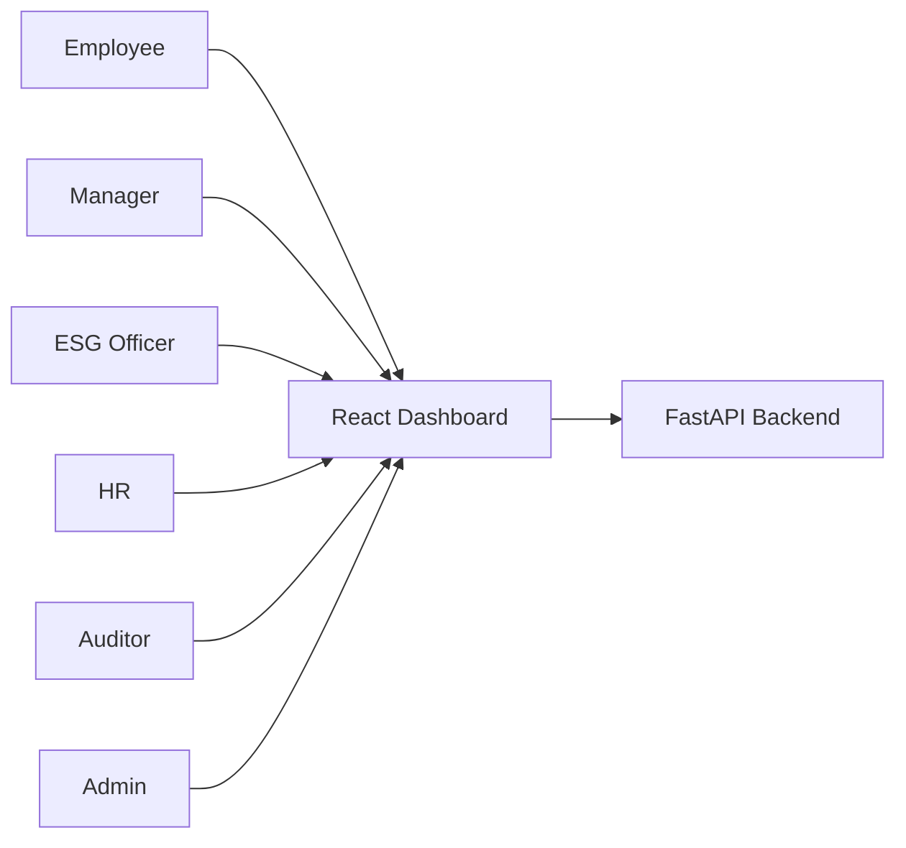

**Explanation**

Users access the React dashboard. Every request is forwarded to the FastAPI backend for authentication and processing.

---

# 2. Presentation Layer

**Technology**

- React
- TypeScript
- Tailwind CSS

### Workflow

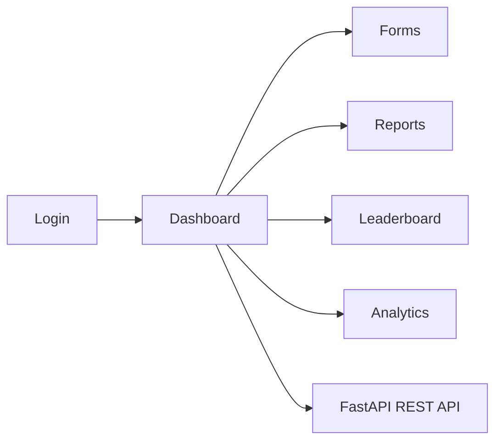

The frontend provides dashboards, forms, analytics, reports, notifications and communicates with the backend through REST APIs.

---

# 3. API Gateway

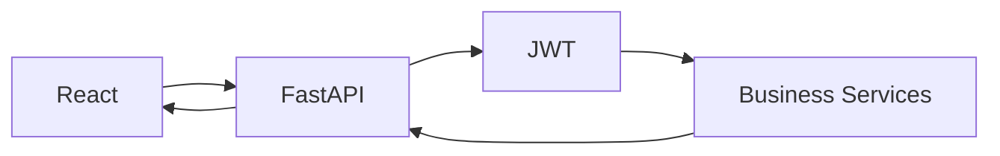

### Responsibilities

- Authentication
- Authorization
- Validation
- Routing
- Business Logic
- Response Generation

---

# 4. Business Services

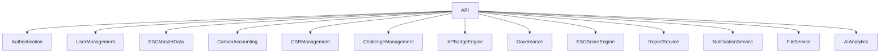

Each service is independent and responsible for one business capability.

---

# 5. Carbon Accounting Flow

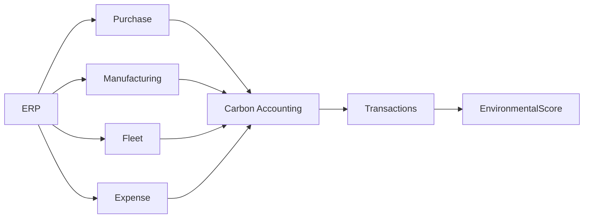

### Explanation

ERP operational data is converted into carbon emissions.

The calculated emissions are stored and contribute to the Environmental ESG Score.

---

# 6. CSR & Gamification Flow

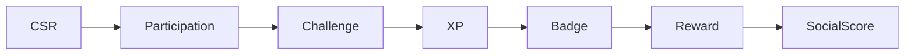

Employees participate in CSR programs, earn XP and badges, redeem rewards and improve the Social Score.

---

# 7. Governance Flow

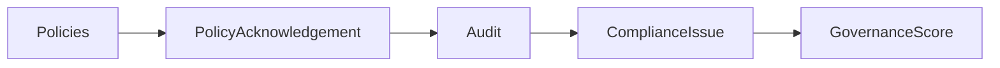

Governance ensures policy compliance through acknowledgements, audits and issue tracking.

---

# 8. ESG Score Engine

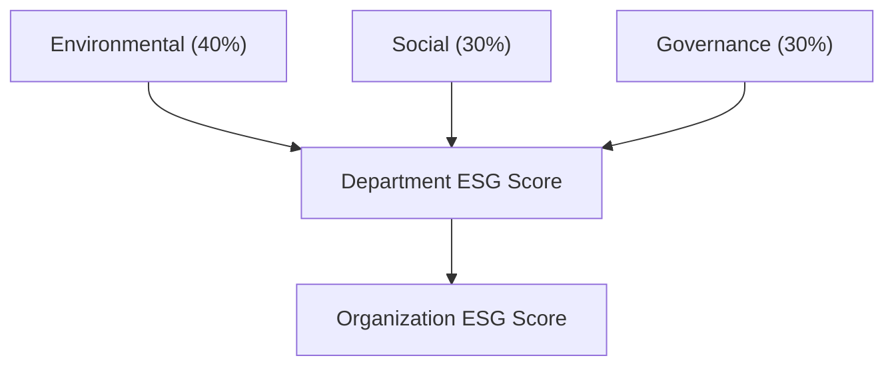

The ESG Score Engine combines Environmental, Social and Governance scores into department and organization-level ESG scores.

---

# 9. AI & Analytics Layer

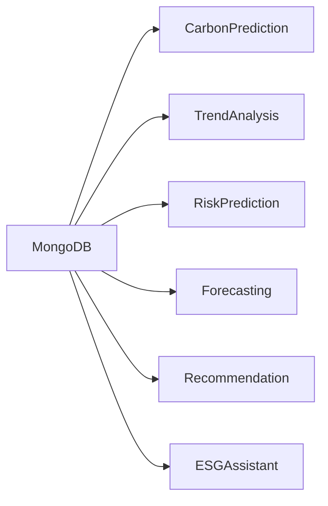

### AI Features

- Carbon Prediction
- ESG Trend Analysis
- KPI Forecasting
- Compliance Risk Prediction
- Sustainability Recommendation
- AI ESG Chat Assistant

---

# 10. MongoDB Database

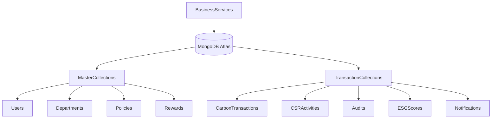

### Master Collections

- Users
- Departments
- Categories
- Emission Factors
- Goals
- Policies
- Rewards
- Badges

### Transaction Collections

- Carbon Transactions
- CSR Activities
- Employee Participation
- Challenges
- Audits
- ESG Scores
- Notifications

---

# 11. External Integrations

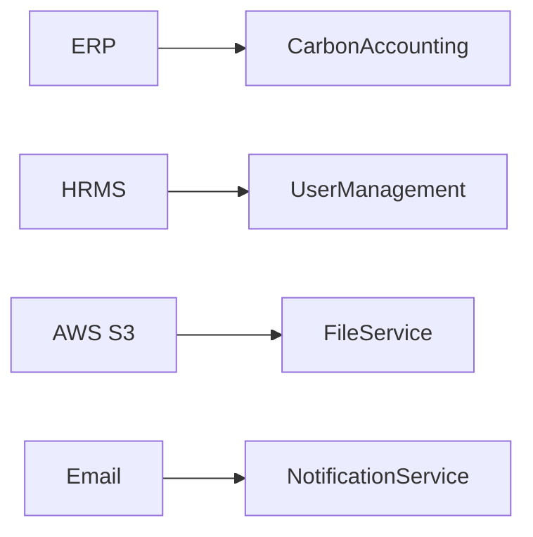

### Integrations

- ERP
- HRMS
- AWS S3
- SMTP Email

---

# 12. End-to-End Workflow

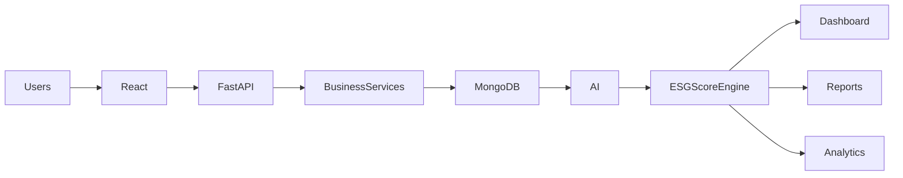

---

# Technology Stack

| Layer | Technology |
|------|------------|
| Frontend | React + TypeScript + Tailwind CSS |
| Backend | FastAPI |
| Authentication | JWT |
| Database | MongoDB Atlas |
| Cache | Redis |
| Storage | AWS S3 |
| Reports | Pandas + OpenPyXL + ReportLab |
| Notifications | Firebase + SMTP |
| Deployment | Docker + Nginx + AWS |

---

# Advantages

- Modular Microservice Architecture
- Scalable FastAPI Backend
- Flexible MongoDB Database
- AI-powered ESG Analytics
- Secure JWT Authentication
- Automatic ESG Score Calculation
- ERP & HRMS Integration
- Cloud-ready Deployment
- Real-time Dashboards
- Easy Future Expansion

---

# Conclusion

EcoSphere integrates operational systems, ESG workflows, AI analytics and MongoDB into a single platform that helps organizations measure, monitor and improve their Environmental, Social and Governance performance through automated data collection, intelligent scoring and real-time dashboards.

